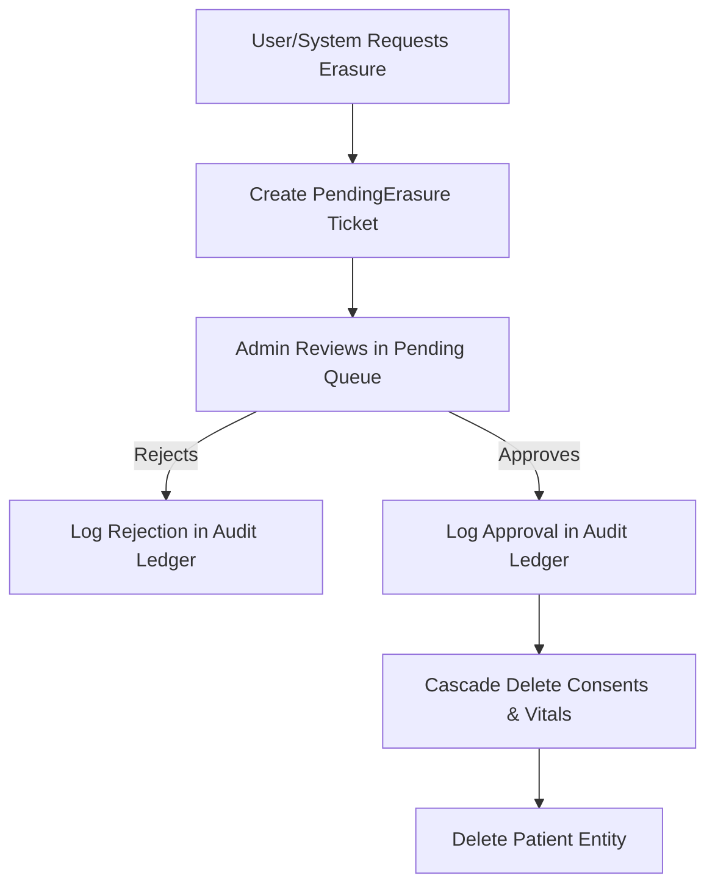

# RescueLink Technical Data Handling Specification

This technical specification details the mechanisms for data storage, encryption, auditing, and right-to-erasure workflows within the RescueLink platform.

---

## 1. Storage & Encryption Schema

### Application-Layer Cryptography
We encrypt all Personal Identifiable Information (PII) and Protected Health Information (PHI) columns in PostgreSQL at the application layer using the Node.js Crypto module.
- **Algorithm**: AES-256-GCM
- **Key Derivation**: Configured using a unique 32-byte key stored in the environment configuration (`ENCRYPTION_KEY`).

### Encrypted Entities
- **Patients Table**: `name`, `dob`, `abha_number`, `emergency_contact_name`, `emergency_contact_mobile`.
- **Users Table**: `mobile`, `totp_secret`.
- **Incidents Table**: `pickup_address`.

---

## 2. Consent Management
Each time a patient or guardian approves sharing clinical telemetry, an entry is generated in the `consents` table:
- **Table attributes**: `patient_id`, `user_id`, `status` (active/inactive), `scope` (e.g. `emergency-only`), `policy_version`, and `expires_at`.
- Active consents are evaluated by the masking middleware before exposing unmasked names to remote systems.

---

## 3. Retention and Right-to-Erasure Workflow

### Retention Policy
Under clinical record guidelines, data is kept only as long as necessary:
- **Emergency Dispatch Incident Records**: 3 Years.
- **Background Compliance Sweeper**: Runs every 24 hours. Matches completed incidents older than 3 years, creating automated `PendingErasure` tickets with the reason `AUTO_PURGE: Incident records older than 3 years retention policy.`.

### Right-to-Erasure Process Flow

- **Sanitized Auditing**: After a purge is executed, the `audit_logs` record retains the fact that a deletion occurred for `patient_id`, but strictly excludes any deleted names, mobile numbers, or health keys.
