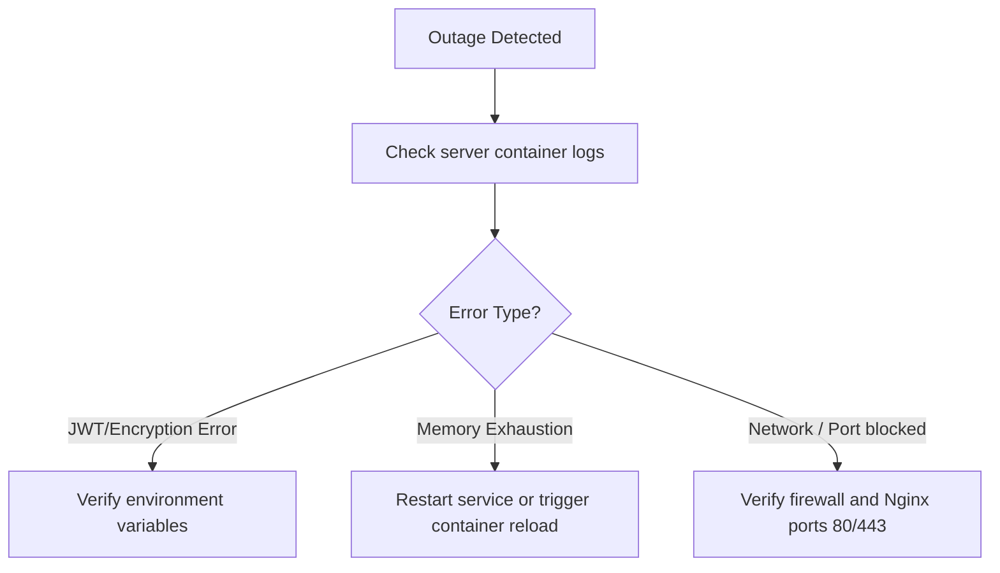

# RescueLink Operational Incident Response Runbook

*This is a safety-critical document. Follow these steps sequentially if system outages occur during live dispatches.*

---

## 1. Initial Triage & Severity Definition

| Severity | Description | Action Time |
|---|---|---|
| **SEV-1 (Critical)** | Entire system down; Socket.io telemetry disconnects on multiple active ambulances. | **Immediate (Within 60s)** |
| **SEV-2 (High)** | Database connection loss, falling back to SQLite local writes. | Within 5 minutes |
| **SEV-3 (Medium)** | Remote telemedicine video links fail; fallback audio works. | Within 15 minutes |

---

## 2. SEV-1 Recovery Flow: Entire System Outage



### Action Steps:
1. **Connect to Application Node**:
   ```bash
   ssh admin@prod-node.rescuelink.in
   ```
2. **Inspect Docker Container Status**:
   ```bash
   docker ps -a
   ```
3. **Inspect Server Logs**:
   ```bash
   docker logs rescuelink-server-prod --tail 100
   ```
4. **Trigger Service Reload**:
   ```bash
   docker-compose -f docker-compose.prod.yml restart server
   ```

---

## 3. SEV-2 Recovery Flow: Database connection loss

When PostgreSQL disconnects, the server automatically routes incoming records to SQLite memory fallbacks (`/data/rescuelink.sqlite`).

### Recovery Steps:
1. Check PG connection health:
   ```bash
   pg_isready -h localhost -p 5432
   ```
2. Restart PostgreSQL database container/service:
   ```bash
   docker-compose -f docker-compose.prod.yml restart postgres
   ```
3. **Data Reconciliation**:
   Once PostgreSQL is online, trigger the data sync scripts to push SQLite records back to the main PostgreSQL cluster.

---

## 4. Alternate Routing Runbook (Driver/Paramedic Fallback)

If the server remains unresponsive after 5 minutes:
1. **Relay Instructions**: Paramedics must switch to standard radio (wireless static channels) or phone cellular communication to announce arrival/NEWS2 triage levels.
2. **Offline Mode**: Paramedics use the RescueLink PWA offline mode to queue incident notes locally. Telemetry syncs automatically once the network recovers.
